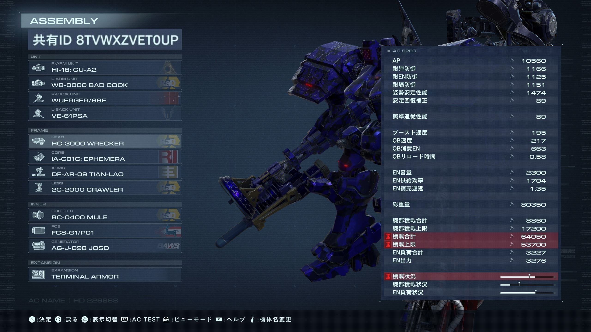

# はじめに
この文章は[遊生黄泉路さん](https://twitter.com/Yuki_Yomizi)主催のAC6対人大会、[うんち杯](https://tonamel.com/competition/qQLm5)アセン構築のための解析である。本大会はリンク先にもあるように、互いに弱い機体を構築してそれらを交換して戦いを進める、通常の対戦とは一味違う特殊な大会である。このため普段の勝利のためのアセン構築ではなく、以下に不便な機体を押し付けることができるかという負のアセン構築力が必要になる。　　

構築にはプレイ上のフィーリングが非常に重要だが、参加者を眺めたところリーダーボード上位の方も参加登録されていることから、フィーリングだけで機体構築をしても結果は出せないだろうと考えた。また、インパクトを残すことも難しいので、ギョームでも使っているデータ解析を絡めて独自性・特色を出すことが本記事のモチベーションとなる。ある程度AC6を熱心にやっている人向けに書いたところもあり、文中のパーツ名などは略称・通称を記載している場合がある。

パーツのデータは[ARMORED CORE @ ウィキ](https://w.atwiki.jp/armoredcoreforever/)記載のものを使用しているが、パーツ価格など戦闘に関係のない要素は削除している。解析はともかくデータ収集については筆者の技術が足ず、人力でデータをコピペ・入力したのでタイポなどがあるかもしれないがその点はご了承いただきたい。  

なお、データは再配布していいかわからなかったので未公開の予定だが、基本的にウィキのデータを使えば再現可能である。また、弾速などのマスクデータは利用していないので、実際の使用感とは異なる部分があるかもしれない点は本解析の限界となる。筆者が普段触っているのはエツジンLRB盾3プラ中2でSランクレート1500前後、使用経験があるのは3ミサ軽2パルブレ、エツジン赤ネビュラ盾10連重2、カニタンクであり、軽四、 一般的なタンク、逆関節など、ここから外れるアセンについて十分理解していない可能性がある点も限界である。逆にこの辺りの脚部を採用したうんちアセンが出場するならそれがどういう形なのかとても気になる。  

解析にはR ver 4.4.0および、RパッケージであるFactoMineR, factoextraパッケージを利用し、主成分分析を使って解析・可視化・解釈を行った。ちょっとしたデータの加工や読み込みにはreadxl, tidyverseパッケージを利用している。また、図の見栄えを良くするためにtheme_set()関数でテーマを設定しggrepelパッケージで文字の重なりをなるべく避けている。解析のためのコードは見栄えのために表示していないが、[GitHubにあげておいたので興味がある方はどうぞ。](https://github.com/siero5335/AC6_unchi_cup) (データは規約不明のため公開しない)。

```{r, include=FALSE}
library(readxl); library(tidyverse); library(FactoMineR); library(factoextra); library(ggrepel)
theme_set( theme_bw(base_family = "HiraKakuProN-W3")) # histgram
```

# 結論


長いので最初に結論から。  

戦績は2回戦敗退だったが方向性は悪くなかった。  
軽レザショが思ったよりパワーがあり、その点が反省。  

筆者が考える弱いアセンの定義を、全体として機動力が低くかつ、内装と武装がチグハグであることとして構築した。  

EN供給補正は良いがペラペラなエフェメラの良さをジェネとの組合せで台無しにしていく。空力コアも候補だったが、効率だけは良いけどその他はよろしくないMULEブースターの利点をより重く、ブースタ効率もそんなにパッとしないエフェメラで台無しにしていくというデザインとした。これにより重量は80000少々にも関わらず巡航195, QB速度217とかなりいい感じの鈍重さを出していくことに成功した。エネルギー供給効率も1704となかなか満足のいく低さ。    

大会の趣旨上まともに動ける機体が出てくることは期待できないので、ロックオンして撃つと追尾がかかって飛んでいくミサイルは採用しなかった。初期ジェネはエネルギー武器補正が弱いのでパルスガン・エネルギーショットガンを組合せて逆のシナジーを取っていく。当たらない火炎放射器は破壊力が低下するので重りとして採用したが火力そのものは高いことは気がかりである。  

FCSは初期FCSとした。近距離武装多めのため最初は逆シナジーを期待して近距離適性が無のVE-21Bを採用していたが、鈍足引き打ち火炎放射が意外と悪くなかったので差し替え。総火力低下のためにスクトゥムを採用。使いようによればかなり強力な盾ではあるが、重量とEN負荷の観点、およびせっかくスクトゥムが美味しい防御を発揮する段階になっても、メイン火力の火炎放射器やキック、エネショのCSを打ったら盾が止まるところが嬉しいので選出とした。  

火器類はいずれも考えて構築すればある程度以上の性能を発揮しうるが、組み合わせ次第でカスの武装になってくれることを期待している。  

拡張機能は産廃機体同士の決戦でAPが削りきれず、腐る可能性が最も高いTerminal Armorとした。  

アリーナでの実戦投入試験をしたところ、コンセプト破綻機体を十分に使った経験がない筆者が操作していたということを考慮しても、メーテルリンク相手に初戦敗北、その後勝った勝負でも大概死闘になったのでそれなりに満足のいく結果となった。単純にデータをみただけではなく、ある程度の時間プレイした経験もある程度反映されられたかと思う。 

機体名は[HDE226868](https://www.isas.jaxa.jp/j/column/famous/01.shtml)。筆者はAC6がいい感じにSFだったこともあり、機体名は天体や宇宙での現象に基づく名前にしている。HDE226868は有名ブラックホールはくちょう座 X-1の伴星であり、つよつよなブラックホールに色々と吸い上げられている天体である。ご友人機体ミルクトゥースのパーツをされに体質を弱めた感じの選定になったので、よわよわなご友人から連想して思いついた。共有IDは8TVWXZVET0UP、steam版。

では以降、それぞれの項目ごとにパーツのデータを図にして比較し、こちらの機体を作る際に考えたことを示していく。はじめはコアから。

# CORE
```{r, include=FALSE}
CORE <- read_excel("data/parts.xlsx", sheet = "CORE")
```

```{r, fig.width=15, fig.height=15, echo=FALSE}
pca_CORE <- PCA(CORE[, -1], scale.unit = TRUE, graph = FALSE)

fviz_pca_biplot(pca_CORE, repel = TRUE, labelsize = 5, pointsize = 1, label ="var") +
  geom_text_repel(aes(label = CORE$name), size = 5) + theme(
      text = element_text(size = 5, face='bold'))
```

図の見方だが、パーツ名が書いてある部分が各パーツの特徴を表す指標をまとめたポイント、矢印がパーツの各数値である。例えばこのコアの図の場合には、基本的に右側が重め、左側が軽めのコアになっており、上下はジェネレータ出力などの差で分かれていることがわかる。 特徴の強さは左右のほうが上下より大きいことになっている (特徴の強さは左右が全体100としたとき59.6, 上下が19なので特徴の強さとしては左右が上下の3倍強いと思って良い) 。　　

VP-40Sがほぼど真ん中に来ており、このコアを軸に何をしたいのかを考えながらアセンを考えていくの良いのかもしれない。禁止パーツのJAILBREAKに方向性的に近いのは初期コアであるORBITER。

一方エフェメラや空力コアはかなり特殊な立ち位置と言えるだろう。例えばこのあたりのパーツを使いつつ、共有を枯らすことができれば特徴を塗りつぶした弱いアセンにすることができるかもしれないが、軽量コアなので重量過多にできるかを考えながらアセンを組み立てる必要があるかもしれない。　　

重量コアは重さを稼ぐのに向いていそうだが、姿勢安定なども高くなるので悩みポイント。重くするなら姿勢安定に関連して来ない腕が良いのかも？

# ARM
```{r, include=FALSE}
ARM <- read_excel("data/parts.xlsx", sheet = "ARM")
```

```{r, fig.width=15, fig.height=15, echo=FALSE}
pca_ARM <- PCA(ARM[, -1], scale.unit = TRUE, graph = FALSE)

fviz_pca_biplot(pca_ARM, repel = TRUE, labelsize = 5, pointsize = 1, label ="var") +
  geom_text_repel(aes(label = ARM$name), size = 5) 
```

次は腕。目を引くのがご友人腕ことWRECKER。JAILBREAKは使用禁止パーツだが、特徴の強さでいうと左右のほうが強いとはいえ飛び抜け方でいうとかなり抜けている。特徴のあるパーツをコンセプトと異なる使い方をするとヤバいことになりそうなので、候補パーツとしてかなり有力か。  

禁止パーツと同じ方向性で攻めるのであればBASHOやTOOL ARMもありうるか。  
近接を積まないBASHOというのもBASHOの無駄遣い感があるのでコンセプトとのギャップを作っていくなら候補になるかも。  

あるいは腕は姿勢安定に寄与しないので、重量過多のためにここで重量を稼いでおくのもありかもしれない。

# HEAD
```{r, include=FALSE}
HEAD <- read_excel("data/parts.xlsx", sheet = "HEAD")
```

```{r, fig.width=15, fig.height=15, echo=FALSE}
pca_HEAD <- PCA(HEAD[, -1], scale.unit = TRUE, graph = FALSE)

fviz_pca_biplot(pca_HEAD, repel = TRUE, labelsize = 5, pointsize = 1, label ="var") +
  geom_text_repel(aes(label = HEAD$name), size = 5) 
```

続いて頭。頭も左右で重量、上下で各種性能や姿勢などが関与している傾向がある。また、面白いことに基本的に重たい頭のほうが高機能であり、対人環境で一定以下重量の頭パーツがほぼ採用されないことと整合性が取れている。  

禁止パーツJAILBREAKはどの性能もあまり良くなく、スキャン待機時間だけが長いというなんとも言えない頭だが、同じ方向性でご友人ヘッドWRECKERがより極端な位置にプロットされている。防御力の指標は良いのだがBASHOには負けてそう。腕もわりとそうだったがご友人はこのアセンでよくまあアリーナtop10に入っているなという気持ち。  

大豊と空力の皿頭sはどちらも微妙な性能だが大豊のほうが微妙。重量過多の帳尻があっていればこちらも選択肢に入るか。

# LEG
```{r, include=FALSE}
LEG <- read_excel("data/parts.xlsx", sheet = "Legwithouttank")
```

```{r, fig.width=15, fig.height=15, echo=FALSE}
pca_LEG <- PCA(LEG[, -c(1, 2)], scale.unit = TRUE, graph = FALSE)

fviz_pca_biplot(pca_LEG, repel = TRUE, labelsize = 5, pointsize = 1, label ="var", 
                habillage= as.factor(LEG$type), invisible="quali") +
  geom_text_repel(aes(label = LEG$name), size = 5) 
```

続いて脚。今回は足の種類があるので脚のプロットは色分けしている。タンクも入れようと思ったが、共通しないデータがかなりはいっていたので今回は泣く泣く除外。  

脚は左右で重量が関連しているが、上下で逆関節, 四脚がきれいに分かれる結果になっている。ここでもご友人脚が半分四脚の領域に凸しており何なのだという気持ち。しかしこれだけきれいに分かれるということは、脚の種別はマスクデータ抜きでも十分に見分けがつくということなのだろう。

```{r, include=FALSE}
LEG2 <- read_excel("data/parts.xlsx", sheet = "Legwithouttank") %>% 
  filter(type == "2")
```

```{r, fig.width=15, fig.height=15, echo=FALSE}
pca_LEG2 <- PCA(LEG2[, -c(1, 2)], scale.unit = TRUE, graph = FALSE)

fviz_pca_biplot(pca_LEG2, repel = TRUE, labelsize = 5, pointsize = 1, label ="var") +
  geom_text_repel(aes(label = LEG2$name), size = 5) 
```

通常2脚だけでも見ておく。JAIBREAKとWRECKERは正反対の位置づけ。だんだん怖くなってきた。とはいえWRECKERは重量級の脚なので、重量過多がOKな今回の環境を考えると、ある程度動けるであろうはずの軽量脚、あるいはそれに準ずる存在に特盛の上半身を載せたい気持ちもある。  

キックの存在があるので逆関節の選定は勇気がいる。キックは主力武装たりうるので、キックの名手がかなり結果を残しそうな気もしている。無難なのはJAIBREAKと同じ方向性かつ中量で積載の少ない初期脚CRAWLER、あるいはナハト以外の軽量脚などが良さそうな気がする。

# BOOSTER
```{r, include=FALSE}
booster <- read_excel("data/parts.xlsx", sheet = "Booster")
```

```{r, fig.width=15, fig.height=15, echo=FALSE}
pca_booster <- PCA(booster[, -1], scale.unit = TRUE, graph = FALSE)

fviz_pca_biplot(pca_booster, repel = TRUE, labelsize = 5, pointsize = 1, label ="var") +
  geom_text_repel(aes(label = booster$name), size = 5) 
```

続いてブースター。MULEは本当に特徴がはっきりしており、EN消費や重量は小さいけど有効な指標もすべて低水準であることが伝わってくる。現実として弱いのかはともかく、数値の上では相当弱そうに見える。  
本大会に上半身ご友人が大挙するのではないかという不安が出てきた。  

肩幅でよく使われるP10と方向性は近いのだが推力などが低すぎて選択されないのだろう。一方で弱い肩幅として動かしてくる上位者がいる可能性がある点には注意すべきか？  

FLUGELはミニNGIという印象だったのだが図の上でもそうなっていて直感とズレていなそう。ALULA・SPDは似た分野だがGILLSも方向性としては近い模様。  

強いパーツを選ぶ視点では結局のところ重視したい指標によるとしか言えないが、よく名前を見かけるアルラやNGIは特徴がよく出ていると思う。そういう意味では数値特徴からだけでは見つけにくいP10が見つかったのは凄い（小並  

# FCS
```{r, include=FALSE}
FCS <- read_excel("data/parts.xlsx", sheet = "FCS")
```

```{r, fig.width=15, fig.height=15, echo=FALSE}
pca_FCS <- PCA(FCS[, -1], scale.unit = TRUE, graph = FALSE)

fviz_pca_biplot(pca_FCS, repel = TRUE, labelsize = 5, pointsize = 1, label ="var") +
  geom_text_repel(aes(label = FCS$name), size = 5) 
```

FCS。パラメータ少なめ。初期FCSは矢印がめちゃくちゃ短くてどのスペックも絶妙にだめなことがわかる。

一方負荷は大きくない点はポイント。遠距離対応はVE-21A, 21B位しかないので、これに近接を組み合わせるのは結構色んな人がやっていそうな気がする。  

21BはEN負荷が高いのも嬉しい。中距離が割と良いのは懸念点だがどう出るか。
  
# GENERATOR
```{r, include=FALSE}
GENERATOR <- read_excel("data/parts.xlsx", sheet = "GENERATOR")
```

```{r, fig.width=12, fig.height=10, echo=FALSE}
pca_GENERATOR <- PCA(GENERATOR[, -c(1, 2)], scale.unit = TRUE, graph = FALSE)

fviz_pca_biplot(pca_GENERATOR, repel = TRUE, labelsize = 5, pointsize = 1, label ="var",
                habillage= as.factor(GENERATOR$type), invisible="quali") +
  geom_text_repel(aes(label = GENERATOR$name), size = 5) 
```

ジェネレータ。これも脚同様タイプごとに特徴があるので色分けしている。ジェネのタイプで結構はっきり特徴が出ているのが面白い。  

NGI, SAN-TAIの突出が目立つが、これらはプレイヤーなら十分理解している通り、強さで抜けているので選ぶなんて論外である。

初期装備のJOSO, ジェネに文句をつけられがちフロイトの20Aなどもある意味特徴が出ているので選定候補になりうる。  

HOKUSHIもカツカツにできさえすれば相対的に特徴のない部類かつ復元は早くないのであるのかもしれない。

# HAND WEAPON
```{r, include=F}
hand <- read_excel("data/parts.xlsx", sheet = "hand")
```

```{r, fig.width=12, fig.height=10, echo=FALSE}
pca_hand <- PCA(hand[, -c(1, 2)], scale.unit = TRUE, graph = FALSE)

fviz_pca_biplot(pca_hand, repel = TRUE, labelsize = 5, pointsize = 1, label ="var",
                habillage= as.factor(hand$type), invisible="quali") +
  geom_text_repel(aes(label = hand$name), size = 5) 
```

ある意味では本命の手武器。大きく分けると単発威力、射程、連写性能、マガジン弾数などに基づいて分かれていそう。  

チャージの問題やオーバーヒートなどの問題があるが、エネルギー武器のオーバーヒートまでの弾数はマガジン弾数と同じ、
リロード時間はチャージもチャージ出ないものも一応同じということにした。このあたりは実際には違う可能性があるので、
上の図が必ずしも正確ではない可能性はある点ご了承いただきたい。 また、特殊武器とミサイルは挙動が違うので入っていない。単発武器の連射性能は1/リロード時間としている。

ハンドガンとショットガンは方向性として割と近いところに来ているのは面白い。ガトリングは完全に突出しているが、基本的にはマシンガンの延長として捉えてよさそうだ。  
しかし手武器は極端な性能のものが図を引っ張っていて、図からだけでは強力な武装を見つけられるかというとそうでもないところは面白い。例えば重ショットガンやエツジンは見えるところにはあるものの、そこまで突出した指標がある可能とそうでもない。強力な武装として知られるLRBやNEBULA, HARRIS, RANSETSU-RFなんかも割と真ん中の方に位置しており、そこまで指標として突出しているわけではない。見にくいがRANSETSU-RFとRANSETSU-ARがほとんど同じところにプロットされているあたりも、プレイヤー視点からすると違和感を感じるだろう。  

また、割とそれぞれの指標全体として特徴のあるパーツが全体的に分布しており、指標ベースでいうと上のジェネレータでも感じたがかなり調整されているのだろうなと思った。　　

それでも強力な武装とそうでもない武装が存在するのは、指標として重要になる数値が限られている部分にある、あるいは今回含めていない弾速などのデータが重要のかもしれない。  

実際のところどれが産廃なのかというのはデータ上からは伝わってこなかった。  
俺はたった今からデータを捨てる!

# SHOULDER WEAPON
## SHIELD
```{r, include=FALSE}
shield <- read_excel("data/parts.xlsx", sheet = "shield")
```

```{r, fig.width=12, fig.height=10, echo=FALSE} 
pca_shield <- PCA(shield[, -c(1, 2)], scale.unit = TRUE, graph = FALSE)

fviz_pca_biplot(pca_shield, repel = TRUE, labelsize = 5, pointsize = 1, label ="var", 
                habillage= as.factor(shield$type), invisible="quali") +
  geom_text_repel(aes(label = shield$name), size = 5) 
```

ここから肩武器。性質が違いすぎるのでカテゴリを分けて考える。まずはシールド。これもタイプごとに特徴があるので色分けしている。スクトゥムはIGのかわりにアイドリング時間が存在するが、一個だけなのでIGと同じということにした。産廃性能の盾があれば、それを載せておくことで明確に火力源を減らすことができるので嬉しいポイントである。一方うまく立ち回られると実質APが高くなってしまうので良し悪し。  

SU-R8が一番特徴がないということになっている。最強盾と名高いVP-61PSはそれほどデータ上は目立った感じではない。  
VP-61PBを使いこなせる名手がいないことを期待してこれを積んで火力を下げておくという選択はあるかもしれないが、機動力が終わりの機体が多い可能性が高いことを考えるとなかなか難しい部分がある。スクトゥムの弱点はアイドリング時間だが、参加機体の脚が遅いだろうことを想定するとデメリットにならないだろう。  

そのうえで盾を乗せるならVP-61PBだろうか？重さと負荷を考えるとSU-TT/Cも捨てがたい。

## CANNON
```{r, include=FALSE}
cannon <- read_excel("data/parts.xlsx", sheet = "cannon")
```

```{r, fig.width=12, fig.height=10, echo=FALSE} 
pca_cannon <- PCA(cannon[, -c(1, 2)], scale.unit = TRUE, graph = FALSE)

fviz_pca_biplot(pca_cannon, repel = TRUE, labelsize = 5, pointsize = 1, label ="var", 
                habillage= as.factor(cannon$type), invisible="quali") +
  geom_text_repel(aes(label = cannon$name), size = 5) 
```

続いてキャノン砲系、これも色分けしている。パルスシールドランチャーは含めていない。  

チャージの有無は基本的に攻撃力が上がる方向に働く。グレネードランチャーは独立したカテゴリを作っている。MORLEYも基本的ににた感じの武装だが飛び抜け具合が足りない。EARSHOTが突き抜けてるのを見てメリニットの中の人はガッツポーズしてそう。  

SHAO-WEIとKRANICHはいずれも肩ガトリング的な立ち位置であり、構えもないので独立したところプロットされているのは納得。レザキャ系は全部似たようなカテゴリを作っている。ノンチャのFASANとスタンニードルランチャーが近い感じなのも面白い。スタンニードルランチャーについては放電を加味していないので、実際は攻撃力がもう少し高めになることが想定される。  

このカテゴリ、どれもそれなりに強い印象があり、あまりよわよわアセンに載っている印象が出てこない。  

筆者の発想が貧困である可能性は否めないが…

## MISSILE
```{r, include=F}
missile <- read_excel("data/parts.xlsx", sheet = "missile")
```

```{r, fig.width=12, fig.height=10, echo=FALSE} 
pca_missile <- PCA(missile[, -c(1, 2)], scale.unit = TRUE, graph = FALSE)

fviz_pca_biplot(pca_missile, repel = TRUE, labelsize = 5, pointsize = 1, label ="var", 
                habillage= as.factor(missile$type), invisible="quali") +
  geom_text_repel(aes(label = missile$name), size = 5) 
```

ミサイル。ニードルミサイルだけ有効射程が設定されていましたが、100ｍくらいの差だったのでないものとした。  

ハンミサ・オーロラはここに入れている。チャージコラミサがすごいことになってる。  

これもスペックだけではわからないことが多く、実際に使ってみないとわからない部分がある。  

ハンミサなどは通常ミサと比較するとちょっと困るくらい強いのだが、図からその感じはあまり伝わってこない。  

一方、どのミサイルも基本的には打てば相手の方に誘導がかかって飛んでいくので、命中する可能性が他の武装に比べて高いだろうこと、遠距離から刺せることを考慮すると貧弱機体に装備させたい武装ではない。

# 最後は拡張機能
ここは比較できるデータがそんなに無いが、Terminal Armorを選択した。クロスレンジでモチャモチャした戦いになる可能性が高いことを考えると、攻撃の択としてAssault Armorを持たれるのはあまりうれしくない。同様の理由で普段はあまり使われないとはいえ、Pulse Protectionも有効活用されてしまう可能性がある。絶対の信頼感Pulse Armorが腐ることはないということから消去法でTerminal Armorが選択される。命中率や機動力の問題からAPが削り切れないことも十分考えられるが、このような状況においてTerminal Armorは存在しないことと同義なので、環境を考慮する意味でもTerminal Armorが優先されるだろう。

# 余談
  
Q: そもそも弱いアセンではなく強いアセンを構築するために解析をすべきなのでは？！  
Q: 普段からそういうデータを活用してランクマに潜るべきなのでは？！  
Q: 本業の文章を書くのが遅れているのでは？！  
A: はい...  

# まとめ・最後に
フレームや内装に関してはデータを眺めることで結構面白い特徴がわかったりした。やはりご友人フレームはかなり尖ってたところが伝わってきて恐怖を感じた。フレームだけじゃなくてブースターもだし何なんだあいつは。  

基本的には重たいパーツにはトレードオフとして何かしら尖った性能が付与されている場合が多いため、どのパーツを重りにするかは難しい問題である。

その中でも、フレームについては比較的用意に腕を重りにすることを選択できた。これは頭、コア、脚部についてはAC6において非常に重要な指標である姿勢安定が、これらのパーツを重りにすることで改善されることが多いためである。  

また、脚部については積載上限が設定されているが、基本的に重い脚部ほど積載上限が高い。速度も相応に低くなるが、積載上限が低い脚部に重い構成をあわせるほうがより低速度を実現しやすいため、この選択はある程度妥当性があると考えている。

武器に関してはマスクデータである弾速やDPSなどがかなり重要な指標になるからなのか、表向きの指標を拾うだけではあまりピンとこない部分があった。誰かが計測したデータの使用許可、あるいは自分で測定する機会を持てばもう少し様子が変わってくるかもしれない。  

今回は右側にJOSO補正のかかったパルスガン2本をハンガーで入れ替えつつ、左側には負荷の大きい盾と火炎放射器としている。モッサリした挙動では火炎放射器は当てづらいだろう＆この武装組合せだとキック以外でスタッガーを取るのは困難だろうという考えのもとこの武装を重りに選択している。  

一方、同重量級からそれ以上の武装となると、ガトリングやグレネード、ウォルター砲、KRSVなどが上がってくるが、機動力が終わりの機体に対してはかなり命中することが期待できそうだったため今回は択から外している。とはいえ全体的に機動力うんち機体が多い可能性を考えるとこの選択が良かったのかはわからない。  

よく採用される強力な武器は、命中率やDPSの高さ、衝撃力など、ある程度共通する部分があるのだろうが、使えないパーツを武装の観点から選ぶとなるとかなり難しいと感じた。[アンナ・カレーニナ](https://ja.wikipedia.org/wiki/%E3%82%A2%E3%83%B3%E3%83%8A%E3%83%BB%E3%82%AB%E3%83%AC%E3%83%BC%E3%83%8B%E3%83%8A)の冒頭でも言われているが、幸福な家庭はどれも似通っているが、不幸な家族は不幸のあり方がそれぞれ異なっている、と言う感じで、それぞれの弱さがあるのだろう。[大会前日の遊生黄泉路さんの配信](https://www.youtube.com/watch?v=kfQoLdBlfaQ)において、ユーザーが比較的少ないVvc-760PRプラズマライフルが最注目されたりと、アセンの組合せによってより光を放つ武器はまだまだあるのだろう。本大会と同様の形式や、初代ACMoAにあったような脚部限定大会など、プールが限られた局面でこそ輝くパーツなどもあるかもしれない。実際この大会に参加表明し、パーツの組合せを普段より良く考えることはいい経験になった。    

もし読者がこの部分で詳細な比較が欲しいor追加のデータを使って良いので同様の解析を試してみて欲しいなどがあれば、もう少し深堀りできるかもしれないので[筆者のX](https://twitter.com/siero5335)にご連絡頂けると幸いである。  

…621 本文は読み終わったようだな  
非常に長い文章になってしまったが付き合ってもらってすまない そして感謝しよう  
  
621  
お前を縛るアセンの制限はもう何もない  

これからのお前のパーツ選択が…  
お前自身の可能性を広げることを祈る  


# 参考資料
[1.遊生黄泉路さん](https://twitter.com/Yuki_Yomizi)  
[2.うんち杯](https://tonamel.com/competition/qQLm5)   
[3.ARMORED CORE @ ウィキ](https://w.atwiki.jp/armoredcoreforever/)  
[4.主成分分析(PCA)の気持ち](https://www.youtube.com/watch?v=Etjrjx6iSsQ)  
[5.HDE226868](https://www.isas.jaxa.jp/j/column/famous/01.shtml)  
[6.アンナ・カレーニナ](https://ja.wikipedia.org/wiki/%E3%82%A2%E3%83%B3%E3%83%8A%E3%83%BB%E3%82%AB%E3%83%AC%E3%83%BC%E3%83%8B%E3%83%8A)  
[7.【武器研究】これをミニネビュラって呼んでる人、自分しかいない説【アーマード・コア6】](https://www.youtube.com/watch?v=kfQoLdBlfaQ)  
